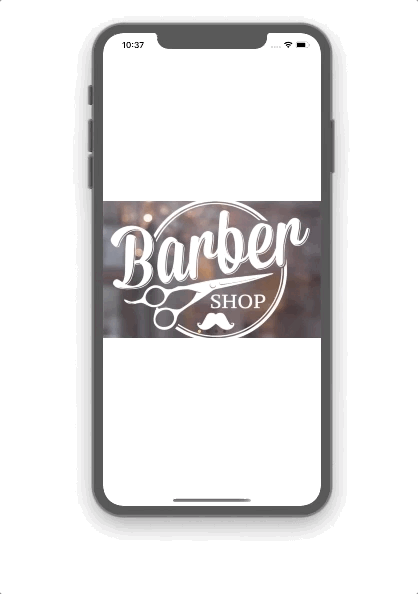

<h1 align="center">Carousel-React-Native</h1>
- This app was developed during the course of RocketSeat using react-native.

## 💻  A screen of demo .

 - A simple app of Carousel image List;

<p align="center">

</p>


## 🎩 How it works

 - Install dependêncies
```sh
yarn
```
 - Run the project
```sh
yarn start
```

GoodLook